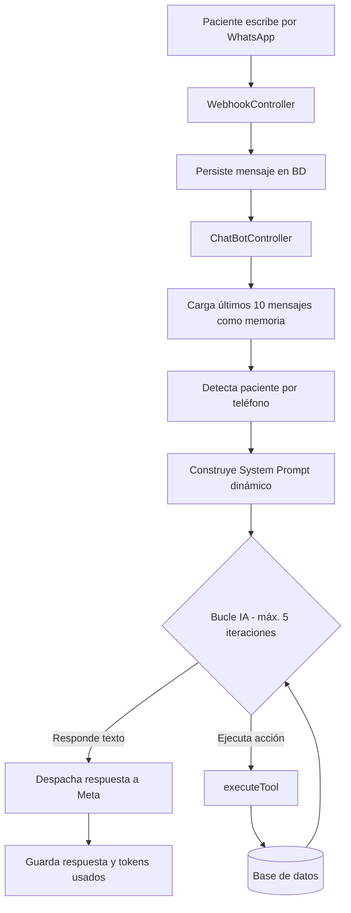

# Asistente Virtual de Citas Médicas por WhatsApp (IA)

Asistente médico automatizado que opera sobre **WhatsApp** y gestiona el ciclo completo de citas (consulta, agendamiento y cancelación) usando **Inteligencia Artificial**. Entiende lenguaje natural y ejecuta acciones reales sobre la base de datos de la clínica mediante **Function Calling**, minimizando la intervención humana.


---

## ¿Qué hace?

Un paciente le escribe por WhatsApp como le escribiría a una persona ("hola, quiero una cita con el doctor Pérez para mañana") y el bot:

- Lo identifica por su número y cédula (con registro automático si es nuevo).
- Busca médicos por nombre o especialidad.
- Calcula los turnos realmente disponibles evitando choques de horario.
- Agenda, consulta o cancela la cita.
- Sincroniza todo con el Google Calendar de la clínica en tiempo real.

Todo en una conversación natural, sin formularios complejos ni códigos.

---

## Características principales

- **IA con Function Calling:** Google Gemini 2.5 Flash decide en cada mensaje si responde texto o ejecuta una de las 9 herramientas conectadas a la base de datos.
- **Memoria conversacional:** carga los últimos 10 mensajes para mantener el hilo de la conversación (RAG básico).
- **System prompt dinámico:** las reglas que recibe la IA cambian según si el paciente ya está validado o no.
- **UI rica de WhatsApp:** usa listas interactivas (selección de médico) y Flows (formularios de registro), no solo texto plano.
- **Algoritmo de disponibilidad propio:** genera bloques de 30 min en una ventana de 30 días y filtra colisiones con citas existentes.
- **Sincronización con Google Calendar:** autenticación con Service Account (JWT RS256) implementada de forma nativa con `openssl`, sin librerías externas.
- **Tracking de costos:** acumula el consumo de tokens de Gemini por conversación y expone un endpoint que estima el costo en USD/COP.
- **Tolerancia a fallos:** límite de iteraciones de IA para evitar bucles, timeouts de red y `try/catch` con logging en cada acción crítica.

---

## Stack tecnológico

| Capa | Tecnología |
|---|---|
| Framework | Laravel (PHP) |
| Base de datos | Eloquent ORM (PostgreSQL / MySQL) |
| Motor de IA | Google Gemini 2.5 Flash |
| Mensajería | WhatsApp Cloud API (Meta Graph API) |
| Calendario | Google Calendar API (Service Account) |
| Fechas / horarios | Carbon |

---

## Arquitectura del flujo



---

## Herramientas de IA (Function Calling)

| Herramienta | Descripción |
|---|---|
| `validar_paciente` | Busca paciente activo; vincula su teléfono automáticamente si falta (*Silent Login*) |
| `registrar_paciente` | Crea o reactiva al paciente (upsert lógico) |
| `consultar_medicos` | Búsqueda por nombre o especialidad, con limpieza de stop-words |
| `consultar_turnos` | Ventana de 30 días, slots de 30 min y algoritmo de colisión |
| `agendar_cita` | Doble validación de turno + re-chequeo de colisión antes de insertar |
| `cancelar_cita` | Soft-delete a estado CANCELADA |
| `consultar_mis_citas` | Citas futuras del paciente |
| `enviar_lista_medicos` | Envía lista interactiva de WhatsApp |
| `enviar_formulario_registro` | Envía un Flow (formulario) de registro |

---

## Algoritmo de disponibilidad de turnos

El cálculo de horas libres no es una simple consulta:

1. Recorre día por día una ventana deslizante de 30 días hasta encontrar disponibilidad.
2. Genera bloques de 30 minutos dentro del turno del médico (contempla turnos nocturnos que cruzan medianoche).
3. Trae todas las citas existentes de ese día y descarta cualquier bloque que se intersecte con una cita ya agendada.
4. Descarta bloques que ya pasaron en tiempo real.
5. Devuelve solo los turnos 100% libres a la IA.

---

## Instalación

```bash
git clone https://github.com/Ilexsa/chatbot_citas_medicas.git
cd chatbot_citas_medicas

composer install
cp .env.example .env
php artisan key:generate
php artisan migrate

# Entorno de desarrollo (servidor + queue + logs + Vite)
composer run dev
```

### Variables de entorno requeridas

```env
# WhatsApp Cloud API (Meta)
WHATSAPP_VERSION=v18.0
WHATSAPP_PHONE_NUMBER_ID=
WHATSAPP_TOKEN=
WHATSAPP_TOKEN_WEBHOOK=

# Gemini AI
GOOGLE_AI_API_KEY=

# Google Calendar (Service Account)
GOOGLE_SERVICE_ACCOUNT_JSON=
GOOGLE_CALENDAR_ID=

# Costos Gemini (opcional)
GEMINI_PRICE_INPUT_PER_1M=0.15
GEMINI_PRICE_OUTPUT_PER_1M=0.60
```

---

## Documentación

La lógica completa del controlador, las reglas de negocio y el detalle de cada herramienta están en [`DOCUMENTACION_LOGICA_CHATBOT.md`](DOCUMENTACION_LOGICA_CHATBOT.md).

---

## Estado del proyecto

Proyecto funcional desarrollado como práctica de integración de IA, automatización y APIs de terceros (WhatsApp, Gemini, Google Calendar) sobre Laravel.
